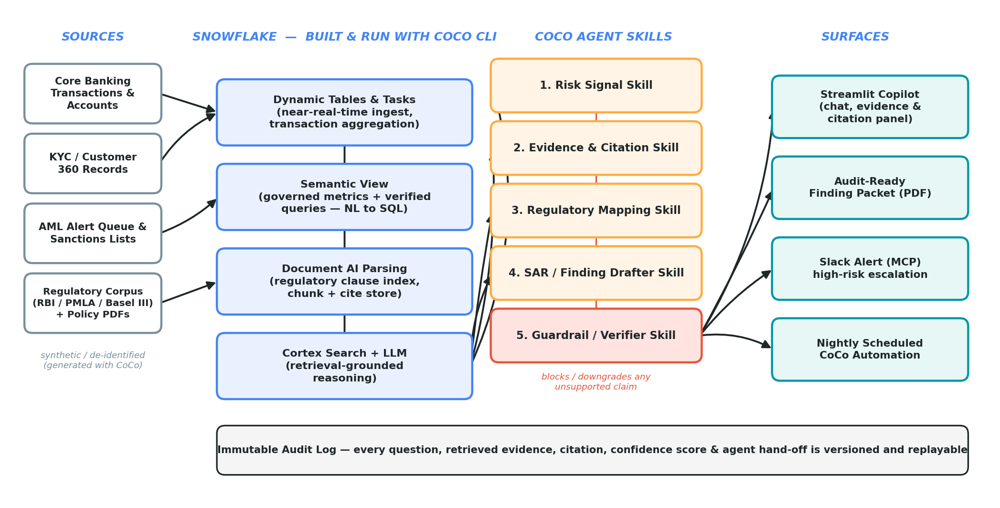

# ClauseTrace

**Evidence-chained Risk, Fraud & Regulatory Intelligence Copilot — built end-to-end on Snowflake CoCo CLI.**

> Snowflake CoCo CLI Hackathon 2026 — GCC Edition
> Challenge 1: Risk, Fraud and Regulatory Intelligence Copilot

---

## The problem

Banking and NBFC compliance teams triage AML/fraud alerts largely by hand. Industry
benchmarks (ACAMS / Everest Group) put the false-positive rate of rule-based transaction
monitoring at **85–95%**, with **30–45 minutes** of analyst time spent per alert. Worse: when
a finding *is* real, the analyst still has to manually assemble evidence and map it to the
exact regulatory clause (RBI KYC Master Direction, PMLA 2002 & Rules, Basel III LCR/NSFR)
before it is audit-usable. That mapping step is manual, undocumented, and inconsistent
across analysts — it's the part regulators actually push back on.

## What ClauseTrace does

ClauseTrace is a natural-language copilot that answers risk/AML/regulatory questions with
**governed, dual-cited answers**: every claim is linked both to the **source transaction
rows** that support it and to the **exact regulatory clause** it satisfies. A dedicated
**Guardrail / Verifier agent** sits between the answer and the user — it blocks or downgrades
any claim it cannot cite, so the system fails safely instead of hallucinating a citation.

This is not "chat with your data." It is an **evidence chain-of-custody layer**: every
question, every retrieved row, every citation, every confidence score, and every agent
hand-off is logged, versioned, and replayable — which is exactly the artifact a compliance
officer or auditor needs, and exactly what most AI-copilot demos skip.

## Repository layout

```
clausetrace/
├── data/                    Synthetic data generator (accounts, KYC, transactions, alerts)
├── regs/corpus/             Illustrative, paraphrased regulatory clause corpus (synthetic)
├── sql/                     Schema, dynamic tables, semantic view, scheduled automation
├── skills/                  5 CoCo agent skills (the reusable, shareable artifacts)
├── app/                     Streamlit copilot (chat + evidence + citation panel)
├── mcp/                     MCP connector config (Slack escalation)
└── docs/                    Architecture diagram and CoCo CLI execution playbook
```

## Architecture

```
Sources (synthetic)                Snowflake — built & run with CoCo CLI          CoCo Agent Skills                 Surfaces
──────────────────                ─────────────────────────────────────          ──────────────────                ────────
Core banking txns/accounts   ──▶   Dynamic Tables & Tasks (near-real-time)   ┐
KYC / Customer 360           ──▶   Semantic View (verified queries)         ├─▶  1. Risk Signal Skill          ┐
AML alert queue + sanctions  ──▶   Document AI parsing (clause index)       │    2. Evidence & Citation Skill  │
Regulatory corpus (PDFs)     ──▶   Cortex Search + LLM (grounded reasoning) ┘    3. Regulatory Mapping Skill   ├─▶ Streamlit Copilot
                                                                                  4. SAR / Finding Drafter Skill│   Finding Packet (PDF)
                                                                                  5. Guardrail / Verifier Skill │   Slack (MCP)
                                                                                       (blocks unsupported     │   Nightly Automation
                                                                                        claims) ────────────────┘
                                         Immutable audit log — every question, evidence, citation, confidence score & hand-off
```



## Quickstart (local demo, no Snowflake account required)

```bash
cd data && python generate_synthetic_data.py        # writes CSVs to data/out/
cd ../app && pip install -r requirements.txt
streamlit run streamlit_app.py                       # local copilot demo over the CSVs
```

The Streamlit app runs fully offline against the synthetic CSVs for local development and
demo rehearsal. In the actual CoCo/Snowflake build, the same questions are served by the
Semantic View + Cortex Search stack in `sql/`, and the app in `app/streamlit_app.py` is what
CoCo scaffolds and iterates on inside Snowsight/Streamlit-in-Snowflake — see
`docs/coco_cli_playbook.md` for the exact prompts used at every stage.

## The five CoCo agent skills

| # | Skill | What it does |
|---|-------|---------------|
| 1 | `risk_signal_skill.md` | Pre-scores incoming alerts against behavioral + rule signals |
| 2 | `evidence_citation_skill.md` | Retrieves and dual-links source rows + regulatory clauses (the reusable, shareable headline skill) |
| 3 | `regulatory_mapping_skill.md` | Maps a finding to the specific clause/section of RBI/PMLA/Basel text |
| 4 | `sar_drafter_skill.md` | Drafts an audit-ready finding packet / SAR narrative from cited evidence |
| 5 | `guardrail_skill.md` | Verifies every claim has a citation before it reaches the user; blocks or downgrades otherwise |

## Status

Hackathon MVP built on **synthetic / de-identified data only** — see `data/generate_synthetic_data.py`.
No real customer, transaction, or regulatory-filing data is used anywhere in this repository.

## License

MIT — see `LICENSE`. Regulatory text in `regs/corpus/` is **original illustrative paraphrase**,
not verbatim reproduction of any RBI/PMLA/Basel publication — see the notice at the top of
each file in that folder.
